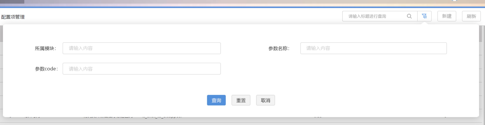

# Search 搜索控件

### 介绍

列表页统一搜索控件，支持简单搜索和高级搜索。 示例可参考`信息报送`的`文稿查询`界面。

### 引入

```js
import { Search } from '@/compontents';

```

## 代码演示

### 简易模式

有些列表搜索条件只有一个条件的情况，只需要简易模式就可以。


```html
<search  placeholder="请输入标题查询" @search="searchHandler">
</search>
```

```js
export default {
  methods: {
    searchHandler(key) {
        //todo:
    }
  }
};
```

### 高级模式
有些列表搜索条件有很多个条件的情况，需要用到高级模式。

通过`content`插槽，会显示高级查询的按钮，点击后会展开高级搜索的内容。
高级搜索的宽度默认会自己计算，请确认两边对外的距离看起来左右间距一致

```html
<Search placeholder="请输入标题查询" @search="searchHandler" :contentVisible.sync="searchContentVisible" :contentStyle="{ right: '-120px' }">
    <template #content>
        <!-- 这里是高级内容 -->
    </template>
</Search>
```
```js
export default {
  data() {
      return {
          searchContentVisible: false
      }
  },
  methods: {
    searchHandler(key) {
        //todo:
    }
  }
};
```


## API

### Props

| 参数 | 说明 | 类型 | 默认值 |
|------|------|------|------|
| placeholder | 输入框的没有值的时候显示的文本 | *string* | `请输入关键字进行查询` |
| contentStyle | 高级搜索的Style样式 | *string* | - |
| contentVisible（支持`.sync`） | 高级搜索的内容是不是显示 | *boolean* | `false` |
| modal | 是否需要遮罩层 | *boolean* | `true` |


### Slots

| 名称 | 说明 |
|------|------|
| content | 自定义高级搜索的内容 |

### Events

| 事件名 | 说明 | 回调参数 |
|------|------|------|
| search | `回车`确定搜索时触发 | *value: string (当前输入的值)* |